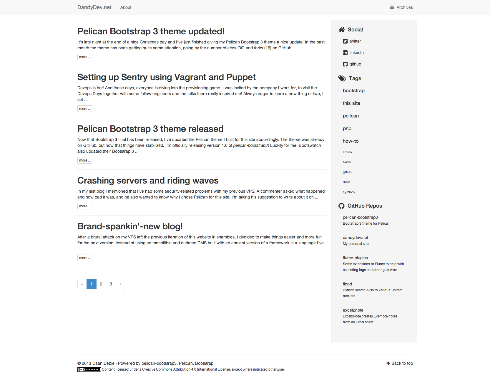

# pelican-bootstrap3

This is a Bootstrap 3 theme for Pelican. It's fully responsive. Bootstrap 3 is still in RC state as of now, so expect changes as the Bootstrap 3 codebase matures. I will try to keep it up-to-date.

## Installation

First:

`git clone https://github.com/DandyDev/pelican-bootstrap3.git`

Then:

Point the `THEME` variable in your `pelicanconf.py` to `/path/to/pelican-bootstrap3`

## Usage

This theme honors the following standard Pelican settings:

* Putting feeds in the `<head>` section:
	* `FEED_ALL_ATOM`
	* `FEED_ALL_RSS`
* Template settings:
	* `DISPLAY_PAGES_ON_MENU`
	* `DISPLAY_CATEGORIES_ON_MENU`
	* `MENUITEMS`
* Analytics & Comments
	* `GOOGLE_ANALYTICS`
	* `DISQUS_SITENAME`

It uses the `tag_cloud` variable for displaying tags in the sidebar. You can control the amount of tags shown with: `TAG_CLOUD_MAX_ITEMS`

Categories are disabled by default because I don't use them myself. If you want to show them in the sidebar, uncomment the relevant section in `includes/sidebar.html`

## Extras

### GitHub

The theme can show your most recently active GitHub repos in the sidebar. To enable, provide a `GITHUB_USER`. Appearance and behaviour can be controlled using the following variables:

* `GITHUB_REPO_COUNT`
* `GITHUB_SKIP_FORK`
* `GITHUB_SHOW_USER_LINK`

### Bootswatch

I included all the lovely Bootstrap 3 themes from [Bootswatch](http://bootswatch.com/), built by [Thomas Park](https://github.com/thomaspark). You can tell Pelican what Bootswatch theme to use, by setting `BOOTSWATCH_THEME` to the desired theme, in lowercase (ie. 'readable' or 'cosmo' etc.). My own site is using _Readable_.

### AddThis

You can enable sharing buttons through [AddThis](http://www.addthis.com/) by setting `ADDTHIS_PROFILE` to your AddThis profile-id. This will display a **Tweet**, **Facebook Like** and **Google +1** button under each post.

## Screenshot

## Live example

[This is my website](http://dandydev.net)